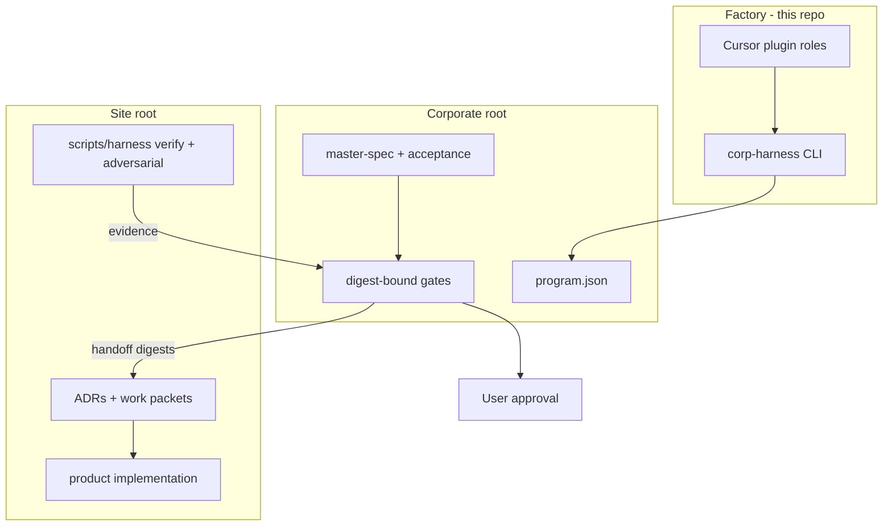
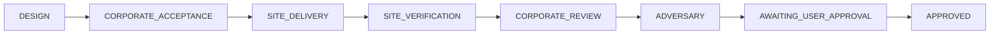

# Corporate/Site Harness

**Evergreen open-source reference** for evidence-gated **Cursor agent delivery** —
corporate agents design and review; site agents implement in an isolated repo;
`corp-harness` advances work only on **digest-bound evidence**. Part of the
[SafetyMP](https://github.com/SafetyMP) portfolio.

Agents propose. Digests decide. Humans approve.

[](https://github.com/SafetyMP/corporate-site-harness/actions/workflows/ci.yml)
[](https://github.com/SafetyMP/corporate-site-harness/actions/workflows/codeql.yml)
[](https://scorecard.dev/viewer/?uri=github.com/SafetyMP/corporate-site-harness)
[](LICENSE)
[](pyproject.toml)
[](CODE_OF_CONDUCT.md)

> **Scope:** Reference architecture and runnable factory control plane — **not** a
> production-hardened enterprise governance product. See [SECURITY.md](SECURITY.md).

**Jump to:** [At a glance](#at-a-glance) · [vs LangGraph / AutoCrew](#why-not-langgraph-or-autocrew) ·
[Install](#install) · [Flow](#project-flow-summary) ·
[Quickstart](#quickstart-product-program) · [How it works](docs/HOW_IT_WORKS.md) ·
[Contributing](CONTRIBUTING.md)

---

## At a glance

| Without the harness | With this harness |
|---------------------|-------------------|
| One chat designs, codes, and declares success | **Corporate** designs; **site** implements; **ops** verifies |
| “Looks good” prose passes reviews | Gate PASS requires **current artifact digests** |
| Agents can self-approve | Only the **user** records final approval |

### Why not LangGraph or AutoCrew?

Stacks like **LangGraph**, **CrewAI / AutoCrew-style** crews, and similar
multi-agent runtimes orchestrate LLM workers **inside one application process**:
graphs, tools, memory, and message-passing between roles. That is valuable for
*building* agent products.

This harness solves a different problem: **governed software delivery in Cursor**.

| | LangGraph / AutoCrew-style runtimes | This harness |
|--|-------------------------------------|--------------|
| **Job** | Run multi-agent *applications* | Gate multi-agent *engineering work* |
| **Where state lives** | Runtime graph / crew memory | Sibling git workspaces + `program.json` |
| **Progress signal** | Model/tool outcomes in-process | Executable verify/adversarial scripts + digests |
| **Authority** | Prompt/policy inside the app | CLI-enforced phases; agents never `--actor user` |
| **Split** | Roles share one runtime | Corporate design vs site implementation (isolated roots) |

Use LangGraph or AutoCrew-style crews to *build* agent systems. Use this harness
when Cursor agents must **design, hand off, implement, falsify, and wait for a
human** without collapsing into one self-approving chat.



Three workspaces stay **siblings** — never nested:

```text
~/work/
├── corporate-site-harness/   ← factory (CLI + plugin)
├── my-app-corporate/         ← program.json + gates + dossier
└── my-app/                   ← product code + site harness scripts
```



| Lane | Who | Job |
|------|-----|-----|
| Corporate | CEO · specialists · COO · adversary | Spec, handoff, review, falsify |
| Site | manager · specialist · operations | ADR packets, implement, verify |
| Human | **user only** | `factory_authorization` · final `user_approval` |

Full stakeholder map and phase contracts: [docs/HOW_IT_WORKS.md](docs/HOW_IT_WORKS.md).

## Install

```bash
pip install -e ".[dev]"
python3 -m pytest -q
python3 -m ruff check src tests
python -m corp_harness --help
```

Full local gate (binds an active program root when present):

```bash
./scripts/harness/verify.sh
```

### Cursor plugin

```bash
corp-harness install --source corporate/plugin/corporate-site-harness --apply
```

Slash commands: `/project-intake`, `/corp-status`, `/site-deliver`,
`/portfolio-orchestrate`. Details in
[corporate/plugin/corporate-site-harness/README.md](corporate/plugin/corporate-site-harness/README.md).

## Project flow (summary)

| Stage | Where | Who |
|-------|-------|-----|
| Design & corporate acceptance | Corporate root | CEO, specialists, COO |
| Delivery & site verification | Site root | Site manager, site specialist, operations excellence |
| Review, adversary, dossier | Corporate root | Specialists, adversary, CEO |
| Final approval | Corporate root | **User only** |

Never nest the corporate root under the site. Never write `program.json` into
the site. Product sites must not edit `src/corp_harness/**`.

## Quickstart (product program)

```bash
# 1) Factory + plugin (above)

# 2) Sibling corporate folder + site checkout
mkdir -p ~/work/my-app-corporate ~/work/my-app
# scaffold site gates from the template, then customize
cp -R site-template/. ~/work/my-app/

# 3) Initialize the program contract (dry-run first)
corp-harness init \
  --root ~/work/my-app-corporate \
  --id my-app \
  --site ~/work/my-app \
  --kind product

# 4) In Cursor: /project-intake  → corporate design through handoff
# 5) Switch to the site workspace: /site-deliver
# 6) User records approval when the program reaches AWAITING_USER_APPROVAL
```

Inspect mechanical state anytime:

```bash
corp-harness status --root ~/work/my-app-corporate
```

## Factory vs product

| | Product (default) | Factory |
|--|-------------------|---------|
| Target | Application site | This checkout (`site_path` = factory) |
| Edits | Product code only | Authorized factory surfaces only |
| Extra gate | — | User-recorded `factory_authorization` before leaving `DESIGN` |

Template: [templates/factory-authorization.TEMPLATE.json](templates/factory-authorization.TEMPLATE.json).

## Repository map

| Path | Purpose |
|------|---------|
| `src/corp_harness/` | CLI and phase/evidence engine |
| `corporate/plugin/corporate-site-harness/` | Cursor agents, skills, rules, hooks |
| `site-template/` | Minimal product-site scaffold with harness scripts |
| `docs/HOW_IT_WORKS.md` | Lifecycle and stakeholder guide |
| `docs/adr/` | Architecture Decision Records |
| `scripts/harness/` | Factory verify + adversarial gates |
| `swift/` | Optional read-only gov-assist sidecar |
| `templates/` | User-facing artifact templates |

## Local runtime state (gitignored)

Created by local runs; **not** part of the published tree:

- `programs/` — optional factory-local program folders
- `evidence/` — resume / delivery receipts
- `archives/` — archived payloads
- `.corp-harness-program-root` — pointer to an active corporate root

## Community

| Resource | Purpose |
|----------|---------|
| [CONTRIBUTING.md](CONTRIBUTING.md) | Setup, DCO sign-off, PR expectations |
| [CODE_OF_CONDUCT.md](CODE_OF_CONDUCT.md) | Contributor Covenant 2.1 |
| [SECURITY.md](SECURITY.md) | Private vulnerability reporting |
| [SUPPORT.md](SUPPORT.md) | How to get help |
| [GOVERNANCE.md](GOVERNANCE.md) | Maintainer model and decisions |
| [CHANGELOG.md](CHANGELOG.md) | Release notes |

## License

Apache License 2.0. See [LICENSE](LICENSE) and [NOTICE](NOTICE).
