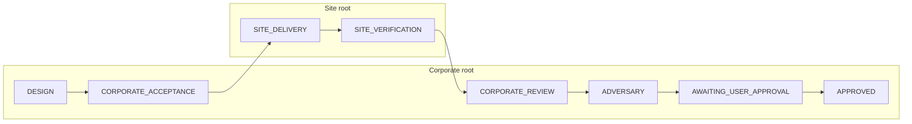

# How a project moves through the harness

This document explains the three workspaces, the phase machine, and the agent
stakeholders. The CLI (`corp-harness`) is the only writer of `program.json`;
agents propose work and record evidence, but they never invent a passed gate or
grant user approval.

## Three workspaces

| Workspace | Role | What lives here |
|-----------|------|-----------------|
| **Factory** | This repository | `corp-harness` Python package, Cursor plugin, factory verify scripts |
| **Corporate root** (`--root`) | Program control plane | `program.json`, master spec, acceptance, handoff, gate evidence, final dossier |
| **Site** (`--site`) | Product (or factory) implementation | Application code, ADRs, `scripts/harness/{verify.sh,adversarial.sh}` |

Hard rules:

- Corporate root is a **sibling** directory with its own git root — never nested under the site or under `factory/programs/<id>`.
- Never write `program.json` into the site.
- Product sites must not edit factory sources (`src/corp_harness/**`).

```text
~/work/
  Cursor-Harness/          ← factory (this repo)
  my-app-corporate/        ← corporate root (program.json lives here)
  my-app/                  ← site (implementation lives here)
```

## Lifecycle phases

Exact phase names from the runtime:

```text
DESIGN
  → CORPORATE_ACCEPTANCE
  → SITE_DELIVERY
  → SITE_VERIFICATION
  → CORPORATE_REVIEW
  → ADVERSARY
  → AWAITING_USER_APPROVAL
  → APPROVED
```

| From | To | Transition actor |
|------|----|------------------|
| `DESIGN` | `CORPORATE_ACCEPTANCE` | `ceo` |
| `CORPORATE_ACCEPTANCE` | `SITE_DELIVERY` | `coo` |
| `SITE_DELIVERY` | `SITE_VERIFICATION` | `site-manager` |
| `SITE_VERIFICATION` | `CORPORATE_REVIEW` | `operations-excellence` |
| `CORPORATE_REVIEW` | `ADVERSARY` | `corporate-specialist` |
| `ADVERSARY` | `AWAITING_USER_APPROVAL` | `ceo` |
| `AWAITING_USER_APPROVAL` | `APPROVED` | **`user`** |

Failed or stale gates rework back to an earlier phase (usually `SITE_DELIVERY`,
or `DESIGN` when corporate acceptance fails). Only the **user** can reopen from
`AWAITING_USER_APPROVAL` / `APPROVED`.



## Agent stakeholders

Seven Cursor agent roles (schema `corporate-site-roles/v2`) plus the human user.

### Corporate side (design, gates, review)

| Role | Workspace | Responsibility |
|------|-----------|----------------|
| **corporate-ceo** | Corporate | Intake, specialist routing, synthesize `master-spec.md` + `acceptance.json`; after adversary, prepare `final-dossier.md` |
| **corporate-specialist** | Corporate | One domain packet: design requirements/risks, or review conformance against master-spec IDs |
| **corporate-coo** | Corporate | Executable completion gates, KPIs/SLOs, `corporate-handoff.json` digests (+ optional execution policy) |
| **corporate-adversary** | Corporate | Run `scripts/harness/adversarial.sh`, falsify completion claims; does not fix |

Corporate roles are **readonly** with respect to product code. They write program
artifacts under the corporate root via `corp-harness record`, not by editing the site.

### Site side (implement and verify)

| Role | Workspace | Responsibility |
|------|-----------|----------------|
| **site-manager** | Site | Verify handoff digests; decompose into consequential ADRs and bounded work packets; dispatch order |
| **site-specialist** | Site | **Only writable implementer** — one ADR packet in an isolated worktree; run local verification |
| **operations-excellence** | Site | Independent accept/reject via `scripts/harness/verify.sh`; attest packets; reject stale or policy-violating evidence |

### Human authority

| Actor | What only they can do |
|-------|------------------------|
| **User** | Record `factory_authorization` and `user_approval`; advance `AWAITING_USER_APPROVAL` → `APPROVED`; record premium usage invoices |

Agents **never** pass `--actor user`. A green gate is not user approval.

## What happens in each major stage

### 1. Corporate design (`DESIGN` → `CORPORATE_ACCEPTANCE`)

1. Bootstrap a separate corporate folder; `corp-harness init --root … --site …`.
2. CEO launches specialists; synthesizes master spec and acceptance criteria.
3. COO turns intent into executable gates and a digest-bound handoff.
4. For **factory** programs (`--kind factory`), stop until the user records
   `factory_authorization` bound to the current `master_spec` digest
   (see [templates/factory-authorization.TEMPLATE.json](../templates/factory-authorization.TEMPLATE.json)).
5. Corporate-acceptance evidence must be current before leaving this stage.

### 2. Site delivery (`SITE_DELIVERY` → `SITE_VERIFICATION`)

1. Switch the agent workspace to the **site** root.
2. Site manager verifies handoff digests and splits work into ADR-scoped packets.
3. Site specialists implement in isolated worktrees (`.worktrees/<packet-id>`).
4. Operations excellence runs `./scripts/harness/verify.sh` and records an
   independent PASS/FAIL against current digests.

### 3. Corporate close-out (`CORPORATE_REVIEW` → `APPROVED`)

1. Specialists review site evidence against the master spec (conformance, not vibes).
2. Adversary runs authorized probes via `./scripts/harness/adversarial.sh`.
3. CEO packages the final dossier.
4. Program waits at `AWAITING_USER_APPROVAL` until the **user** records approval
   and advances to `APPROVED`.

## Evidence and gates

Named gates are bound to phases and reviewer roles:

| Gate | Phase | Typical command |
|------|-------|-----------------|
| `corporate_acceptance` | `CORPORATE_ACCEPTANCE` | `./scripts/harness/corporate-acceptance.sh` (corporate cwd) |
| `site_verify` / `operations` | `SITE_VERIFICATION` | `./scripts/harness/verify.sh` |
| `corporate_review` | `CORPORATE_REVIEW` | `./scripts/harness/verify.sh` |
| `adversary` | `ADVERSARY` | `./scripts/harness/adversarial.sh` |

Workflow:

```bash
corp-harness check --root <corporate> --run <gate>
corp-harness record --root <corporate> --gate <gate> --status PASS|FAIL …
corp-harness next --root <corporate> --to <PHASE> --actor <role>
```

Digest binding means a PASS becomes invalid if target artifacts change. Producers
cannot approve their own work. Prefer `corp-harness status` over narrative claims.

## Factory vs product programs

| | Product (default) | Factory |
|--|-------------------|---------|
| Site path | Application repo | This factory checkout |
| Implementers edit | Product site only | Authorized factory surfaces only |
| Extra artifact | — | User-recorded `factory_authorization` before `CORPORATE_ACCEPTANCE` |

## Cursor entry points

| Command / skill | When |
|-----------------|------|
| `/project-intake` | New idea → corporate CEO workflow (stop before site implementation) |
| `/corp-status` | Mechanical phase, digests, blockers |
| `/site-deliver` | After handoff, from the site root |
| `/portfolio-orchestrate` | Factory portfolio sensors (readonly; no invented PASS) |

See also [docs/adr/](adr/README.md) for design decisions.
